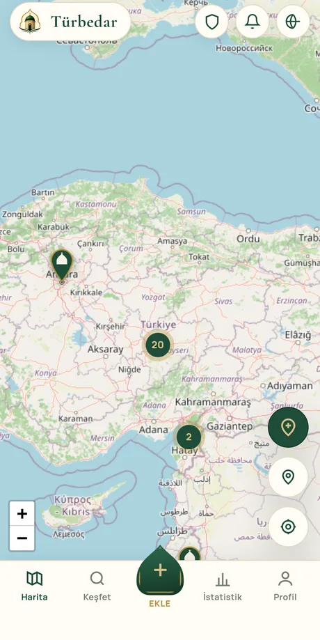
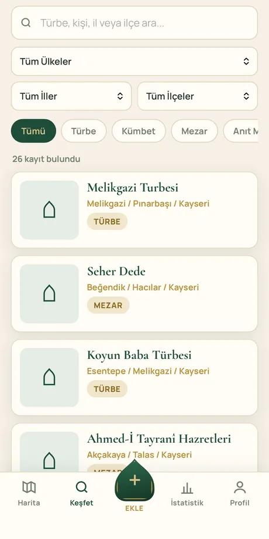
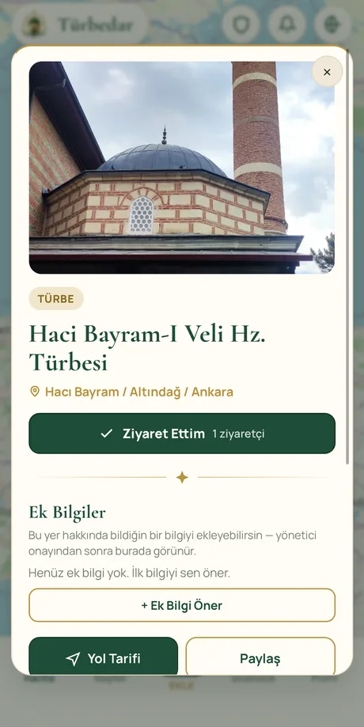
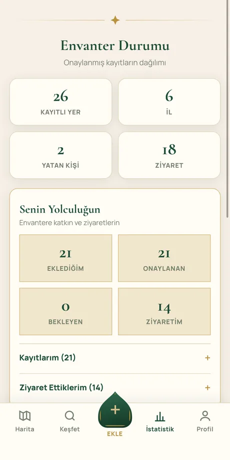

# Türbedar

**Emanet • Hizmet • Sadakat**

_Türkiye'nin ve dünyanın türbe, kümbet ve önemli mezarlarının gönüllü ortak envanteri_

Geliştiricinin diğer uygulamaları için: [kamilsaim.web.app](https://kamilsaim.web.app)

---

## Türbedar nedir?

Türbedar, bir türbenin bakımını ve hizmetini üstlenen kişiye verilen addır. Bu uygulama da aynı ruhu taşır: bu toprakların manevi mirasını oluşturan türbe, kümbet, şehitlik ve önemli mezarları kayıt altına almayı, fotoğraflamayı ve gelecek nesillere taşımayı amaçlar.

Birçok türbe ufak bir köyün kenarında, bir tepenin yamacında, kayıtsız ve bilinmez halde durur. Bir yere gidip o yeri görmüş, fotoğraflamış, hakkında bilgi edinmiş herkes; bu bilgiyi ortak bir hafızaya ekleyebilir. Böylece dağınık bilgi tek bir yerde toplanır, herkesin erişimine açılır.

> _"Allah yolunda öldürülenler için 'ölüler' demeyin. Hayır, onlar diridirler, fakat siz bilemezsiniz."_
> — Bakara, 154

---

## Uygulamadan görünüm

Harita &nbsp;·&nbsp; Keşfet &nbsp;·&nbsp; Yer detayı &nbsp;·&nbsp; İstatistikler

---

## Nasıl çalışır?

Türbedar topluluk temelli bir envanterdir. Herkes katkıda bulunabilir, ama kalite için her katkı bir onay sürecinden geçer:

| | Adım | Ne yaparsın |
|:--:|---|---|
| **1** | **Keşfet** | Haritada veya listede mevcut türbeleri gezersin. İl, ilçe, mahalle ve kategoriye göre arar, sana en yakın yerleri görürsün. |
| **2** | **Ekle** | Gittiğin bir yeri kaydedersin. Fotoğrafını çekersin — konum fotoğrafın kendisinden ya da cihazından otomatik bulunur. Yerin adını, burada yatan kişileri, kaynakları ve varsa video bağlantılarını girersin. |
| **3** | **Onay** | Kaydın yöneticilere ulaşır. Onaylandığında haritada herkese görünür hale gelir — ve sana bildirim düşer. |
| **4** | **Zenginleştir** | Onaylı bir yere herkes fotoğraf, ek bilgi, kaynak veya düzenleme önerisi katabilir. Ziyaret ettiğin yerleri işaretler, yorum yaparsın. |

Aynı yerin tekrar tekrar eklenmesini önlemek için uygulama, yakındaki kayıtları tespit edip seni uyarır ve katkını mevcut kayda yönlendirir.

---

## Öne çıkan özellikler

| | |
|---|---|
| 🗺️ **Harita** | Sokak ve uydu görünümü, kubbe biçimli işaretler, konum tabanlı keşif |
| 📷 **Akıllı konum** | Fotoğraftan otomatik GPS, cihaz konumu veya elle iğne yerleştirme |
| 👥 **Yatan kişiler** | Her yere birden çok kişi, unvanları ve kısa biyografileriyle |
| 📚 **Kaynaklar ve videolar** | Bilginin dayanağını belgele; YouTube, Instagram, X bağlantıları ekle |
| ✅ **Onay ve revizyon** | Kaliteli ve güvenilir bir envanter için yönetici denetimi |
| 🤝 **Topluluk katkısı** | Fotoğraf, ek bilgi, kaynak ve düzenleme önerileri |
| 🕌 **Ziyaret takibi** | Gezdiğin yerleri işaretle, kilometre taşlarında manevi mesajlar |
| 🔔 **Anlık bildirimler** | Kaydın onaylandığı an, telefon kapalı olsa bile haberin olur |
| 📊 **İstatistikler** | Kişisel yolculuğun ve topluluk katkı sıralaması |
| ✉️ **İletişim** | Uygulama içinden yöneticilere mesaj, WhatsApp ile doğrudan ulaşım |
| 📿 **Türbe âdâbı** | Ziyaret hakkında bilinmesi gerekenler bölümü |
| 🔗 **Paylaşım** | Her kaydın kendine ait paylaşım kartı var — WhatsApp ve sosyal medyada başlık, konum ve kapak fotoğrafıyla görünür |
| 📱 **Her cihazda** | Android uygulaması [Play Store'da yayında](https://play.google.com/store/apps/details?id=com.kamilsaim.turbedar); iPhone, iPad ve masaüstünde tarayıcıdan açılır, ana ekrana eklenerek uygulama gibi kullanılır |

> **Bildirimler hakkında:** Android uygulamasında doğrudan çalışır. iPhone/iPad'de uygulamayı önce **ana ekrana eklemen**, sonra Profil'den **"Bildirimleri Aç"** demen gerekir (Apple'ın kuralı). Aynı düğmeden istediğin an kapatabilirsin.

---

## Teknoloji

Türbedar, **tek bir HTML dosyasından** oluşan, derleme adımı gerektirmeyen sade bir uygulamadır. Framework yok, paket yöneticisi yok, build çıktısı yok — `index.html` dosyasını güncellemek yayınlamak demektir.

| Katman | Kullanılan |
|---|---|
| Arayüz | Vanilla JS + CSS, [Leaflet](https://leafletjs.com) haritalar |
| Veri | [Supabase](https://supabase.com) — Postgres, kimlik doğrulama, dosya depolama |
| Güvenlik | Tüm yetkilendirme veritabanı seviyesinde (Row Level Security) |
| Giriş | Google ile kimlik doğrulama |
| Bildirim | Android'de Firebase Cloud Messaging, iOS/masaüstünde Web Push (VAPID) |
| Yayın | [Firebase Hosting](https://firebase.google.com/products/hosting) + [GitHub Pages](https://pages.github.com) |
| Mobil | [Capacitor](https://capacitorjs.com) ile Android paketi |

Android uygulaması web sürümünü sarmalar: web tarafı güncellendiğinde mobil uygulama da **yeni sürüm yüklemeden** güncellenir.

---

## Sürüm Geçmişi

| Sürüm | Öne çıkanlar |
|-------|--------------|
| **1.42** | Yeni yorumlar artık takip edilebiliyor: kaydın sahibine ve yöneticilere anlık bildirim (push dahil); yönetim panelinde tüm yorumları gösteren "Yorumlar" sekmesi |
| **1.41** | Haritada arama: üstteki mercek düğmesiyle türbe, yatan kişi, il veya adres arama; adres sonucunda haritanın kendiliğinden uygun yakınlığa gelmesi |
| **1.40** | Hakkında sayfasındaki paylaşım bölümü yenilendi: bağlantı turbedar.web.app, sürüm notları bağlantısı ve iPhone/iPad kullanım tarifi |
| **1.39** | Tüm uygulama ikonları yeni logoyla yenilendi (uygulama simgesi, açılış ekranı, bildirim ikonu) |
| **1.38** | Kayıt sihirbazında adres arama: yer adı yazarak haritada konumu bulma |
| **1.37** | Play Store puanlama istemi; galeriden seçilen fotoğrafın konumu için Android izni eklendi |
| **1.36** | iOS'ta "ana ekrana ekle" yönlendirmesi yenilendi (Instagram/Facebook içi tarayıcılar için "Safari'de aç" kartı); Android kenardan kenara ekran boşlukları; çift tıklama korumaları |
| **1.35** | Yere özel paylaşım kartları yayında — bir kaydı paylaşınca WhatsApp'ta o türbenin adı ve fotoğrafı çıkıyor; uygulama Google Play'de yayınlandı |
| **1.33** | Bildirimler profilden kapatılabiliyor; yönetim sekmeleri kaydırırken üstte sabit kalıyor |
| **1.32** | Kaynağı olmayan kayıtlarda nazik katkı daveti; yöneticilere "eksik kayıtlar" çalışma listesi |
| **1.31** | Paylaşılan bağlantılar WhatsApp ve sosyal medyada Türbedar kartıyla görünüyor |
| **1.30** | iPhone ve iPad'de de bildirim: ana ekrana eklenen uygulamaya, telefon kilitliyken bile bildirim düşüyor; masaüstü tarayıcılarda da bildirimler açıldı |
| **1.29** | Yönetici aktivite günlüğü (kurucuya özel); gizlilik politikası Play Store gerekliliklerine göre yenilendi |
| **1.28** | Konum önerme özelliği herkese açıldı; düzenleme sırasında haritada pin taşındığında il/ilçe otomatik yenileniyor |
| **1.27** | Hesabını silme özelliği; uydu görünümü hibrit oldu (yer isimleri görünür); "Kamerayla Çek" ile fotoğraf konumu garantili |
| **1.26** | Ek bilgi önerilerine 3'e kadar fotoğraf; önemli işlemlerde dokunma titreşimi |
| **1.25** | Yöneticilere uygulama içi mesaj, yöneticilere anlık yeni kayıt/öneri bildirimi, uygulama kapalıyken gerçek push |

<b>Daha eski sürümler (1.0 – 1.24)</b>

| Sürüm | Öne çıkanlar |
|-------|--------------|
| **1.24** | Ek bilgideki fotoğraf ana galeriye alınabiliyor veya kapak yapılabiliyor; katkı sıralamasında isimler baş harflerle |
| **1.23** | Logoya dokununca harita tüm kayıtları çerçeveye sığdırıyor |
| **1.22** | Sürüm güncellemesi anında düşüyor (veritabanı + canlı yayın); yorum ve ek bilgi önerileri de anlık; Hakkında'ya GitHub linki ve paylaş butonu |
| **1.21** | Canlı güncelleme: onay/red uygulama açıkken anlık yansıyor |
| **1.20** | Push bildirim altyapısı — cihaz kaydı ve bildirime dokununca ilgili kayda gitme |
| **1.19** | Tarayıcıdan açanlara "ana ekrana ekle" önerisi |
| **1.18** | Harita butonları sağ alt köşede toplandı; APK'da Google girişi sistem tarayıcısında |
| **1.17** | Haritada "buraya ekle" modu — bir noktaya dokunarak yeni kayıt |
| **1.16** | Yurtdışı kayıtlar için ülke bilgisi ve keşfette ülke filtresi |
| **1.15** | WhatsApp iletişim numarası kurucu profilinden yönetiliyor |
| **1.14** | Profile "Türbedar Hakkında" sayfası ve iletişim bölümü |
| **1.13** | Kapak fotoğrafı seçimi |
| **1.12** | Kilometre taşı kutlamaları, onay bildirimleri, "yakınımdaki yerler" |
| **1.11** | Kişisel istatistikler İstatistik sekmesine taşındı, profil sadeleşti |
| **1.10** | Ek bilgi önerilerine fotoğraf ekleme |
| **1.9** | Çoklu kaynak + bağlantı, onaylı yerlere ek bilgi önerme |
| **1.8** | Güncelleme kontrolü ve fotoğraf galerisinde geçiş |
| **1.7** | Kullanıcı istatistikleri ve yönetici kullanıcı araması |
| **1.6** | Video bağlantıları (yer ve yorumlarda) |
| **1.5** | Otomatik baş harf büyütme, haritada uydu görünümü |
| **1.4** | Mükerrer kayıt önleme, mahalle/köy bilgisi |
| **1.3** | Açılış karşılaması, Bakara 154, türbe âdâbı bölümü |
| **1.2** | "Ziyaret ettim" özelliği |
| **1.1** | Harita önizleme kartları, iOS fotoğraf düzeltmesi |
| **1.0** | İlk sürüm: harita, kayıt ekleme, onay sistemi, yorumlar |

---

## Katkı

Türbedar bir gönül işidir. Bir yeri ziyaret ettiğinde fotoğraflayıp eklemen, bilgi düzeltmen ya da eksik bir kaynağı tamamlaman, bu ortak hafızaya katkıdır.

[**Google hesabınla giriş yap ve başla →**](https://turbedar.web.app)

Kaynak, bir kaydı iddiadan bilgiye çeviren şeydir. Bir türbe hakkında kitap, kitabe, makale ya da güvenilir bir bağlantı biliyorsan, o kaydın **Ek Bilgi** bölümünden paylaşabilirsin — en değerli katkı budur.

## Gizlilik

Hangi bilgilerin toplandığı, kimlerle paylaşıldığı ve hesabını nasıl silebileceğin [Gizlilik Politikası](https://kamilsaim.github.io/turbedar/gizlilik-politikasi.html) sayfasında açıkça yazılıdır. Özetle:

- Reklam ve analitik takip **yoktur**
- E-posta adresin hiçbir kullanıcıya gösterilmez
- Konum yalnızca sen izin verdiğinde alınır
- Yüklediğin fotoğraflar cihazında küçültüldüğü için EXIF verileri sunucuya gitmez
- Hesabını uygulama içinden tek başına silebilirsin

---

Edeple gelen, lütufla gider.

